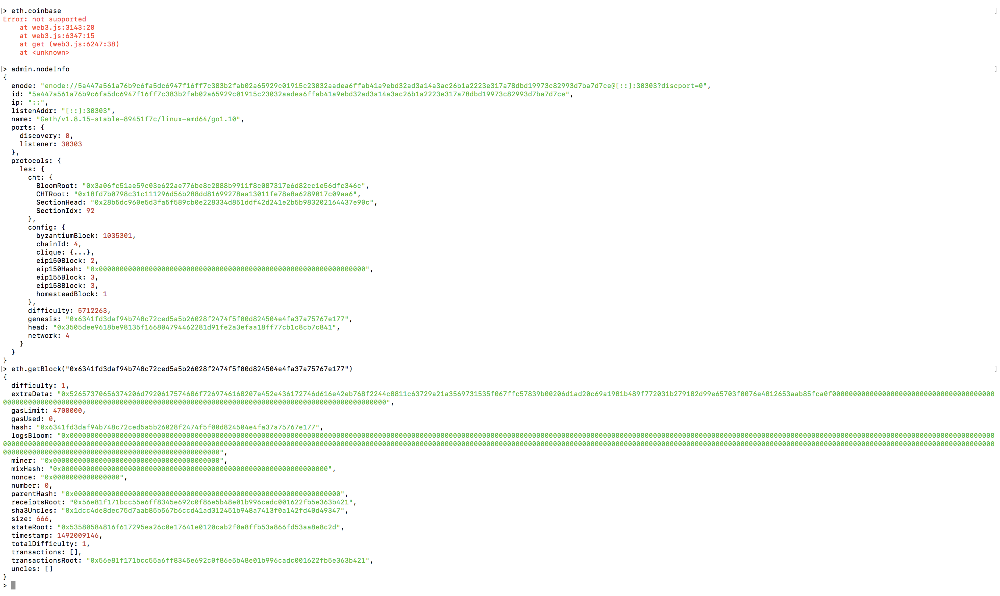
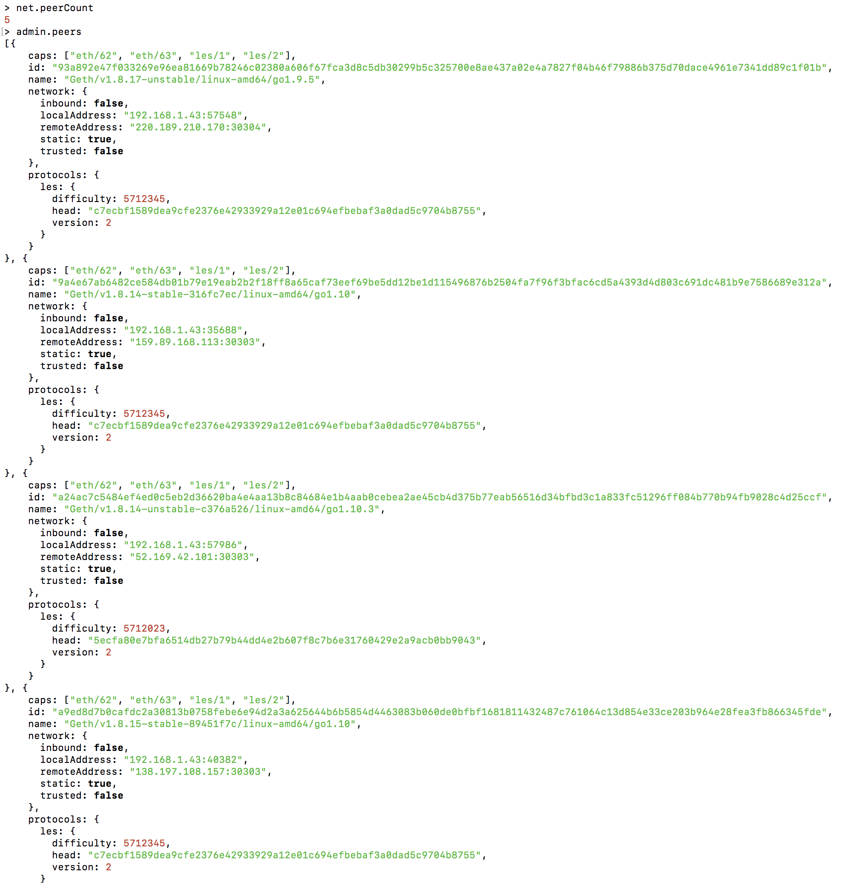
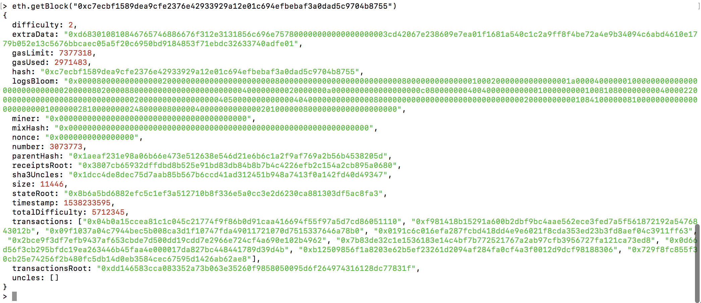

# PEC 1

## Ejercicio 2

> Primero intento acceder a la adress con
```
eth.coinbase
```
> Pero obtengo error en web3 (con el full node el error es "etherbase must be explicity especified"), por lo que prosigo con
```
> admin.nodeinfo
> eth.getBlock(<genesis>)
```



> Obtenemos la cantidad de peers a los que estamos conectados con
```
> net.peerCount
5
```

> Obtenemos información acerca de los nodos y, posteriormente, sus alturas máxima de bloque con
```
> admin.peers
```


```
> eth.getBlock(<head>)
```


