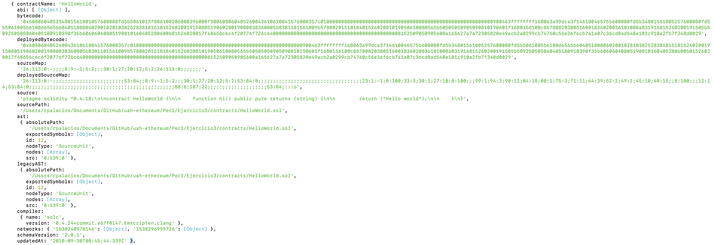
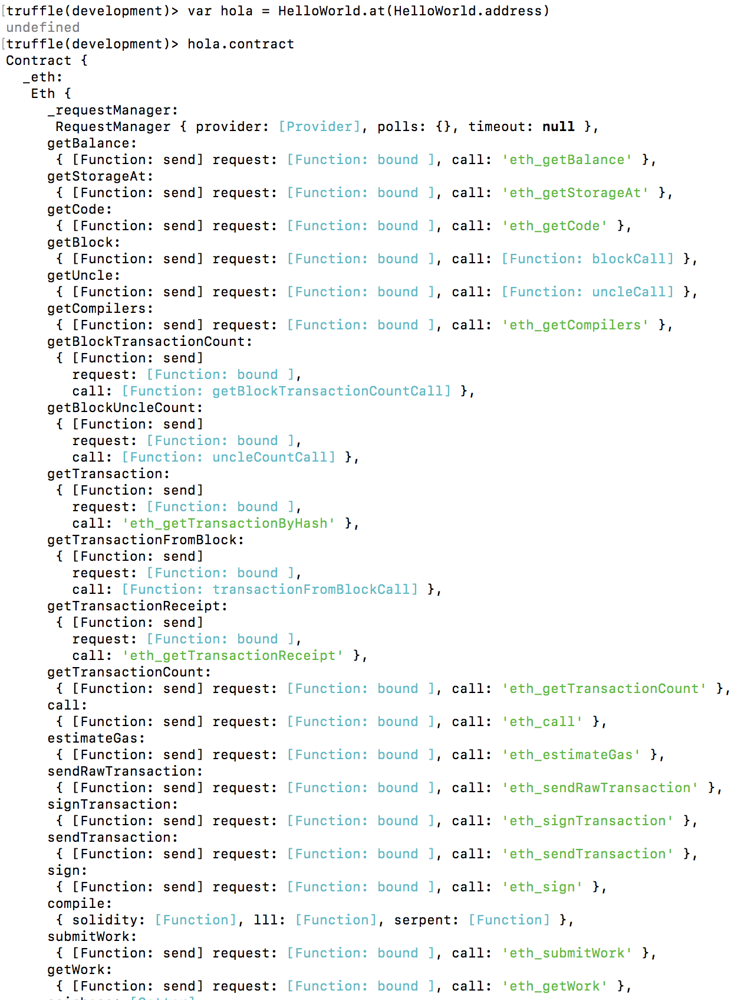
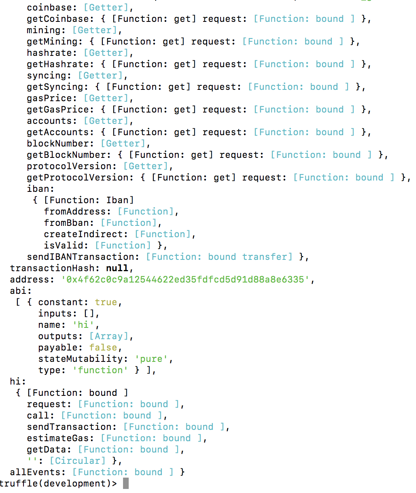
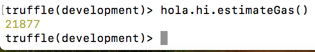

# PEC 1

## Ejercicio 3

> Desplegamos el [contrato inteligente](https://github.com/rpmaya/uah-ethereum/blob/master/Pec1/Ejercicio3/contracts/HelloWorld.sol) usando Truffle para compilar y desplegar (migrate) en Ganache (localhost:8545).

> Accedemos con truffle console e invocamos el contrato HelloWorld, donde obtenemos información del mismo, como sus código de operación:

> Después, con la dirección del contrato, lo guardamos en una variable y obtenemos los identificadores de las funciones de dicho contrato:

> Por último, obtenemos la estimación del gas utilizado por nuestra función "hi" con:

