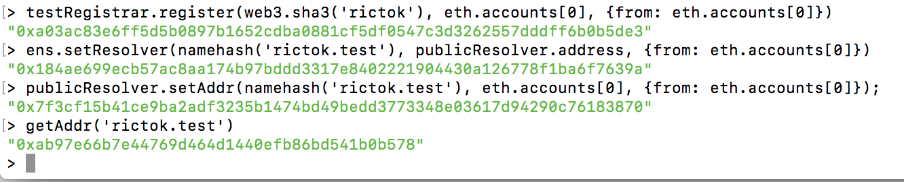

# PEC 2

## Ejercicio 1 - ENS

> Sincronizamos un full node de [Rinkeby](https://www.rinkeby.io/#geth)

> Después, con Geth, nos conectamos, creamos una cuenta y obtenemos Ether, siguiendo estas [instrucciones](https://gist.github.com/cryptogoth/10a98e8078cfd69f7ca892ddbdcf26bc)

> Finalmente, para adquirir nuestro domimio "rictok.test" en Rinkeby, seguimos estas [instrucciones](http://docs.ens.domains/en/latest/quickstart.html) 

> Se adjunta pantallazo con los comandos y sus salidas para adquirir el dominio y mostrar que somos los poseedores del mismo:

