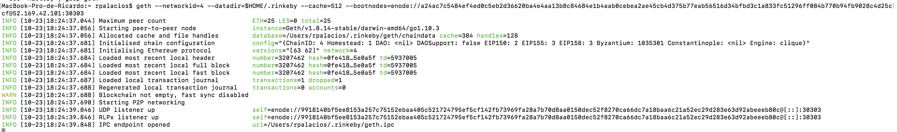
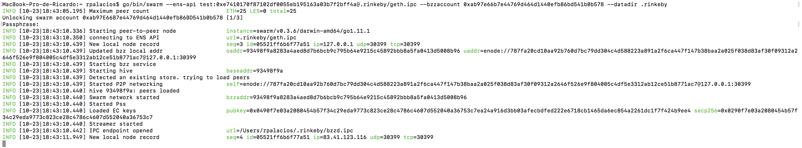
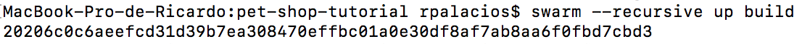
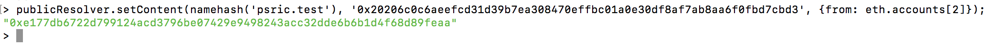
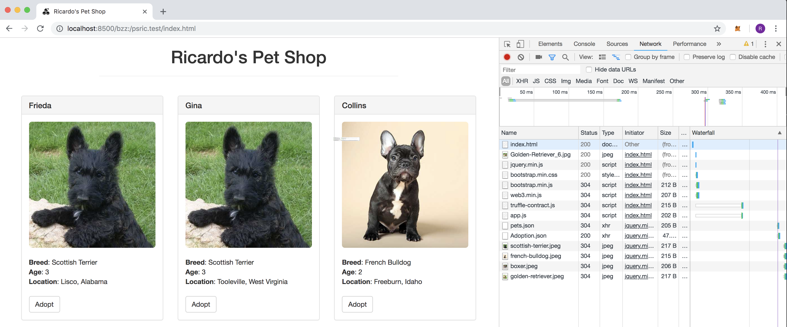

# PEC 2

## Ejercicio 3 - SWARM

> Sincronizamos con la testnet Rinkeby:

> Instalamos SWARM siguiendo estas [instrucciones](https://swarm-guide.readthedocs.io/en/latest/installation.html)

> Inicializamos SWARM

> Subimos el contenido a SWARM en "build" (con los src):

> Donde el hash del raíz de la aplicación es "20206c0c6aeefcd31d39b7ea308470effbc01a0e30df8af7ab8aa6f0fbd7cbd3"

> A continuación, con la consola de geth, modificamos el contenido para nuestro nombre: "psric.test" para que apunte a este hash:

> Accedemos a la aplicación a través de SWARM y del ENS "psric.test":

