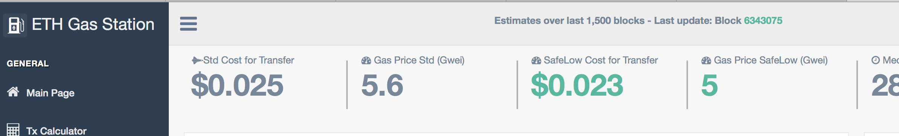
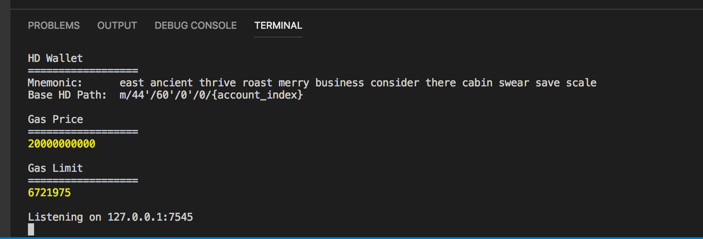
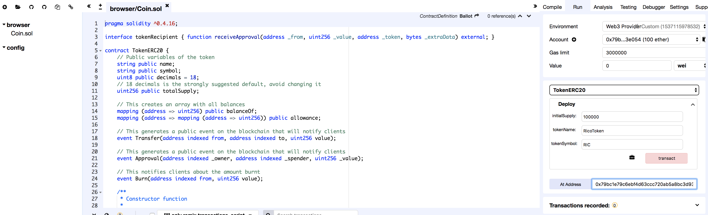
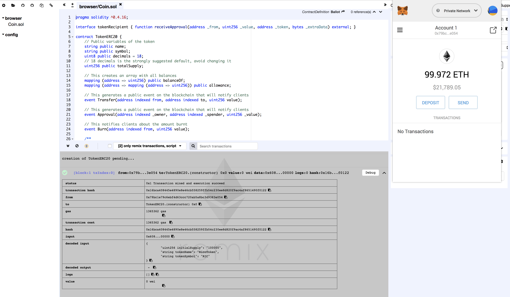
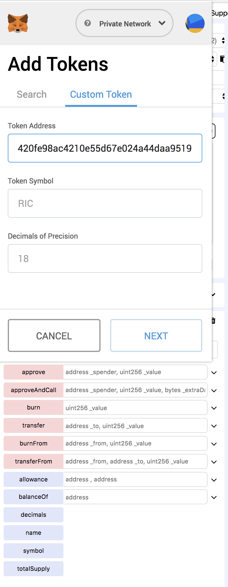
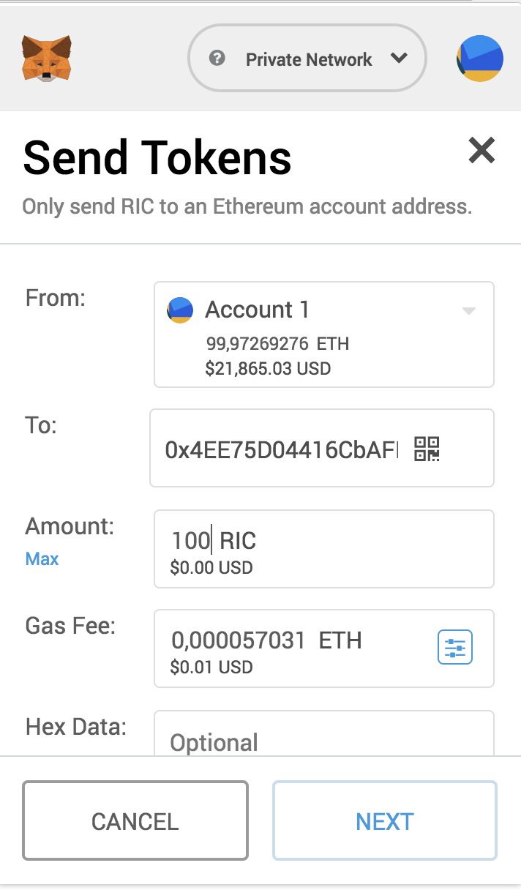
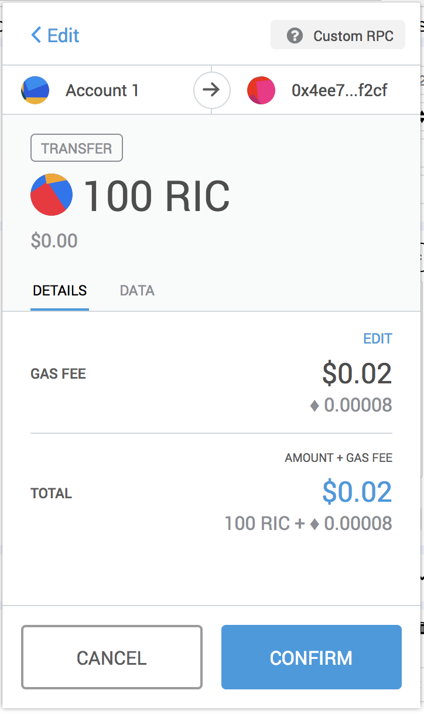
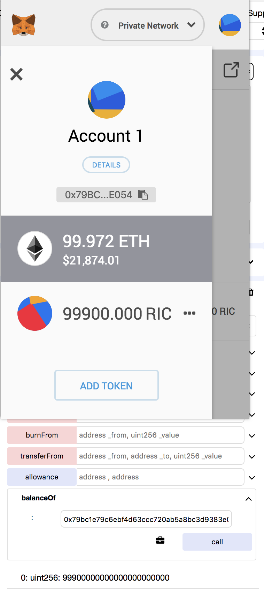

# MÓDULO 1

# Ejercicio 1

## Indique tanto la instrucción utilizada como el resultado de la misma.

https://github.com/ethereum/wiki/wiki/JavaScript-API

- ### Comprobar que existe conexión a un nodo.
```
web3.isConnected()
true
```

- ### Comprobar si está o no sincronizando nuevos bloques. ¿Por qué?
```
web.eth.syncing
false
```

> Porque solo sincroniza bajo demanda.

- ### Balance de la cuenta que ha desplegado el contrato en la blockchain.
```
web3.eth.getBalance("0x79bc1e79c6ebf4d63ccc720ab5a8bc3d9383e054").toNumber()
100000000000000000000
```
- ### Address de la cuenta número 3 de Ganache o ganache-cli.
```
web3.eth.accounts[2]
'0x32b064d10c5aa3e9c9336ee60deda1fdb09d219f'
```

- ### Número de bloque en el que se encuentra la blockchain en ese instante. ¿Por qué?
```
web3.eth.blockNumber
0
```

> Porque solo mina bajo demanda.

- ### Dirección del host de la blockchain.
```
web3.currentProvider.host
'http://127.0.0.1:7545'
```

- ### Acceda a ​[ethgasstation​](https://ethgasstation.info) y convierta el precio del gas en ese instante a Ether.
  
 > El precio actual del Gas es de 5.6 Gwei, es decir 5.6 / 10^9 ether = 0.0000000056 ether

 

 # Ejercicio 2

 Describiremos el proceso, a modo de ejemplo, para el de creación de Token.

> Lanzamos ganache en el puerto 7545



> Abrimos [Remix](https://remix.ethereum.org/) y copiamos el [código](https://www.ethereum.org/token)



> Desplegamos el contrato, comprobando que nos consume ETH



> Añadimos nuestro propio Token desde Metamask en nuestra red privada (ganache)



> Enviamos 100 *RIC* tokens a otra cuenta



> Confirmamos la transferencia



> Por último, comprobamos en Metatask, y con la llamada *balanceOf*, en los *Deployed Contracts* de Remix, que hemos gastado los 100 token



